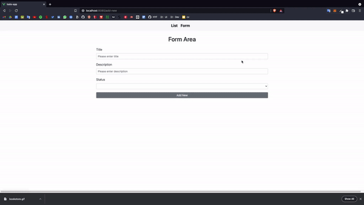

# Todo App



## Demo

Online deployment of this project is available at [Todo App](https://todo-app-ayktldg.vercel.app/).

## Technologies

Vue, Vuex, Vue-Router, Bootstrap, uuid, Vee Validate, Vue Notification

## Features

- Adding todos and changing their status via todo form
- Listing todos according to their status

## Project setup

```
yarn install
```

### Compiles and hot-reloads for development

```
yarn serve
```

### Compiles and minifies for production

```
yarn build
```

### Customize configuration

See [Configuration Reference](https://cli.vuejs.org/config/).
